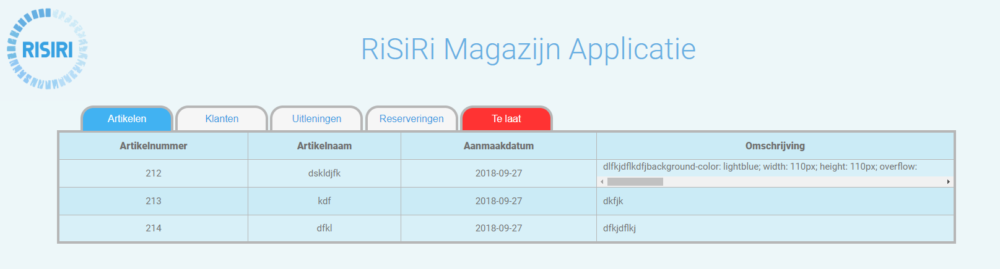

# RiSiRi Plugin 
> warehouse management plugin

## Deployment
1. Copy the project to your local htdocs folder
2. Setup a database for wordpress 

## Built With
* Wordpress

## License
This project is licensed under the MIT License - see the [LICENSE.md](LICENSE.md) file for details

## Contributing

1. Fork it (<https://github.com/yourname/yourproject/fork>)
2. Create your feature branch (`git checkout -b feature/fooBar`)
3. Commit your changes (`git commit -am 'Add some fooBar'`)
4. Push to the branch (`git push origin feature/fooBar`)
5. Create a new Pull Request

## Contributors: 
* Max den Ouden [Github](https://github.com/MextroNL)
* Erwin Jobse [Github](https://github.com/ErwinJobse)
* Jop de Meurichy [Github](https://github.com/jopdm)
* Owen Vermeulen [Github](https://github.com/gitjehub12)
